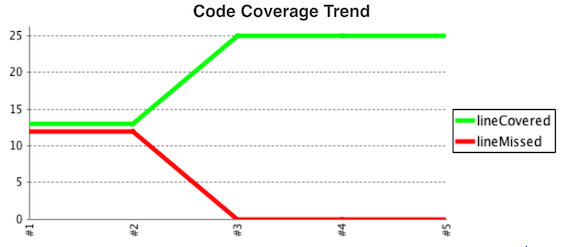
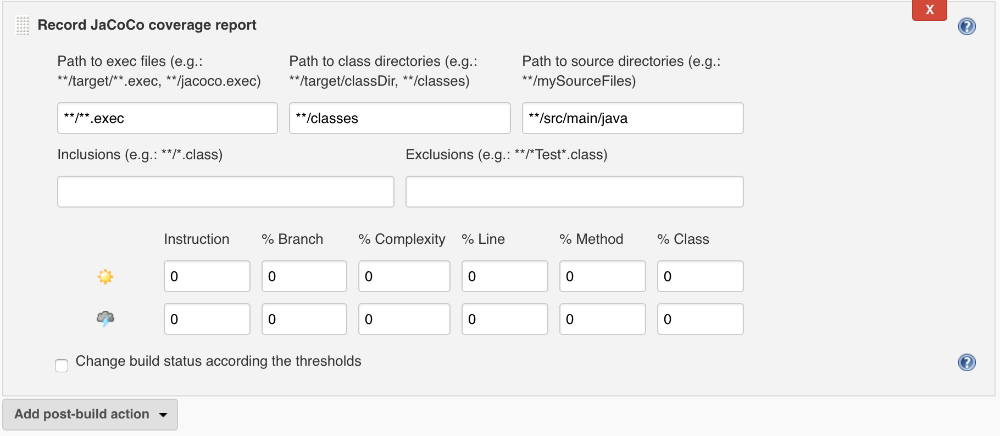
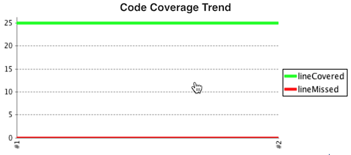
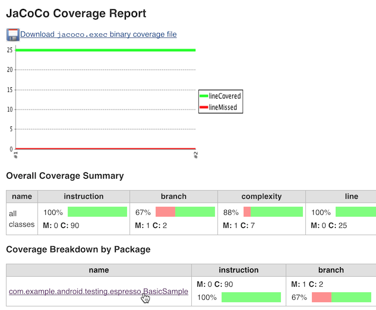

# 與 Jenkins 整合

看完上一節，或許你心中有個問號，既然 `connectedAndroidTest` 已經會自動產生 HTML coverage report，要整合進 Jenkins 不就是利用 [HTML Publisher Plugin](https://wiki.jenkins-ci.org/display/JENKINS/HTML+Publisher+Plugin) 將它整合進 job/build page 就好？

當然要這麼做也可以，但結果就只是個 HTML report，看不出 build 與 build 之間 coverage rate 的消長，像下面這樣：



再者，執行測試不一定是透過 `connectedAndroidTest`，也可能透過其他第三方工具。以 [Spoon](以 http://square.github.io/spoon/) 為例，它只會將 execution data 從測試裝置取出，但不會幫忙產生 coverage report。

若單純要產生 coverage report，利用 [JaCoCo Plugin](https://docs.gradle.org/current/userguide/jacoco_plugin.html) (Gradle) 就可以辦到，但問題又回到在 Jenkins 上看不出 code coverage trend ... 因此最理想的方式，就是有一個 Jenkins plugin 直接面對 execution data，產生 coverage report 之外，也記錄 build 與 build 之間 coverage 的變化。

沒錯，就是 [JCoCo Plugin](https://wiki.jenkins-ci.org/display/JENKINS/JaCoCo+Plugin) (Jenkins)。不過在安裝這個 plugin 之前，得先確認一下 Android Plugin for Gradle 所使用的 JaCoCo 版本，就如同前面章節提到的，JaCoCo 0.7.5 變更了 execution data 的檔案格式，跟舊版本不相容，如果 Android Plugin for Gradle 用的是 JaCoCo 0.7.4 以前的版本，Jenkins plugin 就只能安裝 1.0.19 或更舊的版本，因為新版的 Jenkins plugin 認不得 JaCoCo 0.7.4 以前的檔案格式。

> Unfortunately JaCoCo 0.7.5 breaks compatibility to previous binary formats of the jacoco.exec files. The JaCoCo plugin up to version 1.0.19 is based on JaCoCo 0.7.4, thus you cannot use this version with projects which already use JaCoCo 0.7.5 or newer. **JaCoCo plugin starting with version 2.0.0 uses JaCoCo 0.7.5 and thus requires also this version to be used in your projects. Please stick to JaCoCo plugin 1.0.19 or lower if you still use JaCoCo 0.7.4 or lower.**
>
> -- [JaCoCo Plugin - Jenkins - Jenkins Wiki](https://wiki.jenkins-ci.org/display/JENKINS/JaCoCo+Plugin)

> <i class="fa fa-lightbulb-o fa-3x"></i>
> 要安裝 JaCoCo Plugin 1.0.19，要先到 plugin 頁面的 archives 連結下載 [`jacoco.hpi`](http://updates.jenkins-ci.org/download/plugins/jacoco/1.0.19/jacoco.hpi)，再透過 Manage Jenkins > Managed Plugins > Advanced > Upload Plugin 上傳 `.hpi` 安裝。
> 
> 

安裝好 JCoCo Plugin 後，job 設定頁面的 Add post-build action 就會多一項 "Record JaCoCo coverage report"：



根據上一節的觀察，我們知道 execution data 在 `app/build/outputs/code-coverage/connected/[flavors/{flavor}/]coverage.ec`，產生 report 時要搭配沒有用 JaCoCo 加工過的 class file (`app/build/intermediates/classes/[{flavor}/]debug/**.class`)，並排除一些自動產生的程式碼。

由於 `app/build/intermediates/classes/[{flavor}/]debug/**.class` 會夾雜著一些自動產生的程式碼，比較麻煩的是要如何有效地將它們濾除？這裡利用 inclusion (白名單) 與 exclusion (黑名單) 兩層設定來做過濾：

 * 通常自行開發的程式都會集中在一個套件下，先將該套件底下的 class file 列為白名單，例如 `com/example/**/*.class`。
 * 再將套件下自動產生的程式碼列為黑名單，通常可以從檔名的特徵辨識出來，例如 `**/R.class`。

因此 job 的設定如下：

 * Path to exec files - `app/build/outputs/code-coverage/connected/coverage.ec`
 * Path to class directories - `app/build/intermediates/classes/debug`
 * Path to source directories - `**/src/main/java`

    將所有 subproject 的 source code 都考量進來，因為相關 module 的 class file 都會集中到 `app/build/intermediates/classes/[{flavor}/]debug` 底下。

 * Inclusions - `com/example/android/testing/espresso/BasicSample/**/*.class`
 * Exclusions - `**/R.class,  **/R$*.class,  **/Manifest.class,  **/Manifest$*.class,  **/BuildConfig.class`

> <i class="fa fa-fire fa-3x"></i>
> 注意 "Path to xxx directories" 的設定，結尾的 `/` 必須去掉，否則會有非預期的結果。

執行兩次 job 後 (有兩個數據才能畫出線條)，就可以在 job page 看到類似下面的 (Line) Code Coverage Trend：



點 coverage trend 的圖形，就能打開 coverage report：



雖然 report 的表現方式跟 Android Plugin for Gradle 產生的版本不太一樣，但兩邊的數據是一致的，解讀方式並無不同。

回頭看一下 Jenkins plugin 的 console log，若 coverage report 無法順利產出，或是結果不如預期，可以從這裡找到一些線索：

```
...
:app:connectedAndroidTest

BUILD SUCCESSFUL
...

[JaCoCo plugin] Collecting JaCoCo coverage data...
[JaCoCo plugin] app/build/outputs/code-coverage/connected/coverage.ec;app/build/intermediates/classes/debug;app/src/main/java; locations are configured
[JaCoCo plugin] Number of found exec files for pattern app/build/outputs/code-coverage/connected/coverage.ec: 1
[JaCoCo plugin] Saving matched execfiles:  /Users/jeremykao/work/android-testing/ui/espresso/BasicSample/app/build/outputs/code-coverage/connected/coverage.ec (1)
[JaCoCo plugin] Saving matched class directories for class-pattern: app/build/intermediates/classes/debug:  /Users/jeremykao/work/android-testing/ui/espresso/BasicSample/app/build/intermediates/classes/debug (2)
[JaCoCo plugin] Saving matched source directories for source-pattern: app/src/main/java:  /Users/jeremykao/work/android-testing/ui/espresso/BasicSample/app/src/main/java (2)
[JaCoCo plugin] Loading inclusions files..
[JaCoCo plugin] inclusions: []
[JaCoCo plugin] exclusions: [**/R.class,  **/R$*.class,  **/Manifest.class,  **/Manifest$*.class,  **/BuildConfig.class]
[JaCoCo plugin] Thresholds: JacocoHealthReportThresholds [minClass=0, maxClass=0, minMethod=0, maxMethod=0, minLine=0, maxLine=0, minBranch=0, maxBranch=0, minInstruction=0, maxInstruction=0, minComplexity=0, maxComplexity=0]
[JaCoCo plugin] Publishing the results..
[JaCoCo plugin] Loading packages..
[JaCoCo plugin] Done.
Finished: SUCCESS
```

 1. 確認 execution data 有被找到。
 2. 確認 matched class/source directories 沒有其他不相干的資料夾。

前面提到 "Path to xxx directories" 的設定，結尾不能有 `/`，否則會有非預期的結果。若把 "Path to class directories" 與 "Path to source directories" 分別設定成 `app/build/intermediates/classes/debug/` 與 `app/src/main/java/`，結果就會變成：

```
[JaCoCo plugin] Saving matched class directories for class-pattern: app/build/intermediates/classes/debug/:  /Users/jeremykao/work/android-testing/ui/espresso/BasicSample/app/build/intermediates/classes/debug /Users/jeremykao/work/android-testing/ui/espresso/BasicSample/app/build/intermediates/classes/debug/com ... /Users/jeremykao/work/android-testing/ui/espresso/BasicSample/app/build/intermediates/classes/debug/com/example/android/testing/espresso/BasicSample
[JaCoCo plugin] Saving matched source directories for source-pattern: app/src/main/java/:  /Users/jeremykao/work/android-testing/ui/espresso/BasicSample/app/src/main/java /Users/jeremykao/work/android-testing/ui/espresso/BasicSample/app/src/main/java/com ... /Users/jeremykao/work/android-testing/ui/espresso/BasicSample/app/src/main/java/com/example/android/testing/espresso/BasicSample
```

所有的子資料會逐層被解析出來，這顯然不是我們要的。

