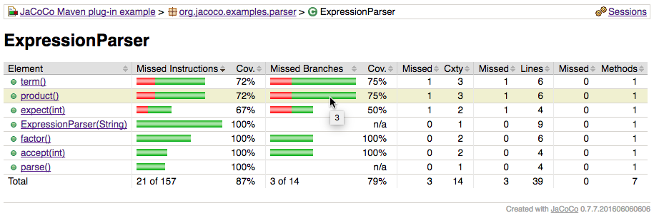

# 解讀 Coverage Report

用瀏覽器開啟 coverage report (`target/site/jacoco/index.html`)：


第一欄 (Element) 表示右側數據統計的範圍，一開始是 Java package (點進去可以展開 class、method 的細節)，之後的欄位依序列出在這個範圍內從不同角度計算的 coverage。

JaCoCo 所有 coverage 的計算都源自於在執行期記錄有哪些 bytecode instruction 被執行過 (execution data)，事後再搭配 class file 裡的 debug information 對應回 source line。要注意的是，一個 source line 可能被編譯成零或多個 bytecode instruction，而一個 bytecode instruction 也不一定有對應的 source line (例如自動產生的 default constructor)，姑且將會產生 bytecode 的 source line 稱做 "可執行" (executable) 的 source line。

前面兩個 coverage 用橫條圖表現，以第 2 欄 (Instructions) 的 instruction coverage 為例：


橫條的長度表示在這個範圍內的總數量 (就這個例子而言，是 package 下所有 bytecode instruction 的數量)，所以第一行的數量大概是第二行的 3 倍。每一橫條再用顏色區分未覆蓋 (紅色) 及已覆蓋 (綠色) 的部份，將滑鼠游標停留在不同顏色的區塊上，就會顯示對應的數量。就第一行而言，紅色與綠色分別對應 65 與 136，也之所以算出來的 coverage rate (Cov.) 是 136 / (65 + 136) = 0.676 => 68% (四捨五入)。

第 3 欄之後的 coverage 只提供數據，所以 coverage rate 要自行計算，以第 5 欄 (Lines) 的 line coverage 為例：


左右兩個數字分別表示這個範圍內 "未覆蓋的數量" (Missed) 及 "總數量" (就這個例子而言，是 package 下所有可執行的 source line 的數量)。所以第一行的 line coverage 是 (45 - 9) / 45 = 0.8 => 80%。

TIP: 如果 Java package 是依功能模組劃分，就可以從這個畫面很快辨識出哪些模組的覆蓋率過低，需要加強測試。

點 `org.jacoco.examples.parser` 的連結，可以看到該 package 底下不同 class 的 coverage：


以 `ExpressionParser` class 為例，instruction coverage 跟 line coverage 可以這樣解讀：

 * `ExpressionParser` class 有 21 (紅色) + 136 (綠色) = 157 個 bytecode instruction，所以 instruction coverage 是 136 / 157 = 0.866 => 87% (四捨五入)。
 * `ExpressionParser` class 可執行的 source line 有 39 行，其中有 39 - 3 = 36 行已覆蓋，所以 line coverage 是 36 / 39 = 0.923 => 92.3%。

一個 source file (`.java`) 可能包含多個 class (例如 inner class 或 non-public class)，若要改以 source file 為單位檢視，可以透過右上方 Source Files / Classes 的連結切換：


由於範例沒有用到 inner class (一個 source file 裡只有一個 class)，所以兩份數據是一樣的。

> <i class="fa fa-lightbulb-o fa-3x"></i>
> 順道觀察另一個 package `org.jacoco.examples.expressions`：
> 
> 
> 
> 眼尖的你可能已經發現，為什麼看不到 `IExpression` 這個 interface？那是因為 interface 本身沒有實作，除非有實作 static initializer 才會被視為 executable class。

點 `ExpressionParser` 的連結，可以看到該 class 底下不同 method 的 coverage：



解讀的方式大致與前面相同，只是少了最後一欄 (Classes)。接著點任何一個 method，就能看到以不同圖示、背景色標示的 source code，這裡用 `product()` 簡單說明 branch coverage 與 line coverage 的計算方式：


L65 跟 L67 都有菱形的圖示，表示這裡有邏輯上的分支 (通常是 `if` 或 `switch`)。綠色表示所有的分支都有被覆蓋 (full coverage)，黃色表示只有部份的分支被覆蓋 (partial coverage)，另外還有紅色表示完全沒被覆蓋 (no coverage)。

上一張圖第 3 欄 (Branches) 的 branch coverage 顯示 `product()` 裡共有 4 個分支，只有 3 個被覆蓋，但哪來 4 個分支呢？將 `else if` 換個寫法，或許就比較容易理解：

```java
if (accept('*')) {
    e = new Mul(e, factor());
} else {
    if (accept('/')) {
        e = new Div(e, factor());
    } else {
        return e;
    }
}
```

Source code 裡所有被標上背景色的行才是 JaCoCo 關心的 (executable) source line，綠色表示這一行所有衍生出的 bytecode instruction 都被執行過 (full coverage)，黃色表示這一行衍生出的 bytecode instruction 只有部份被執行過 (partial coverage)，而紅色則表示這一行衍生出的 bytecode instruction 都沒被執行過。

